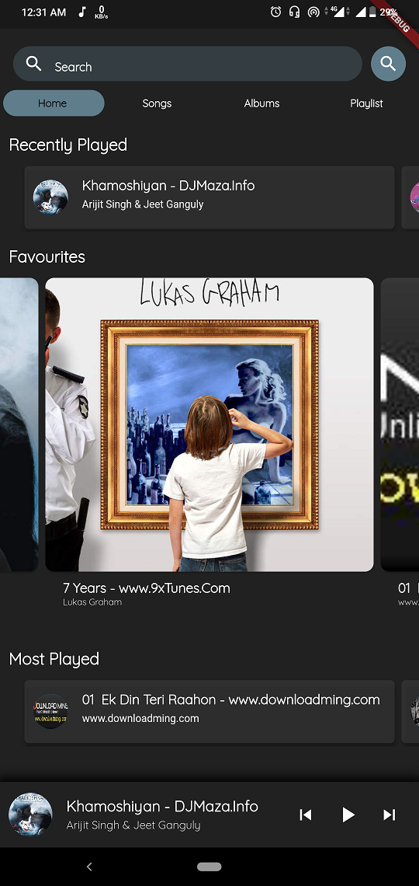
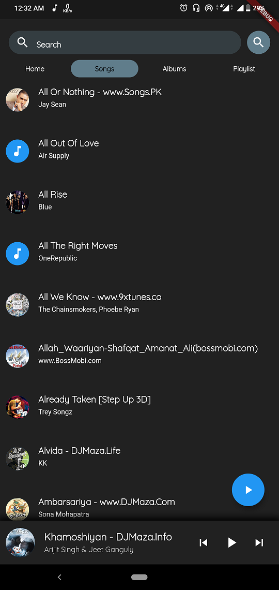
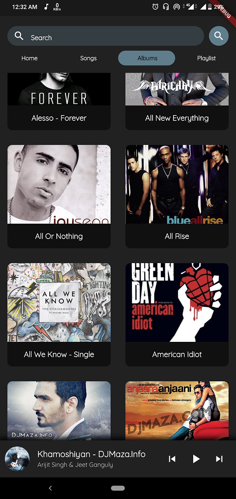
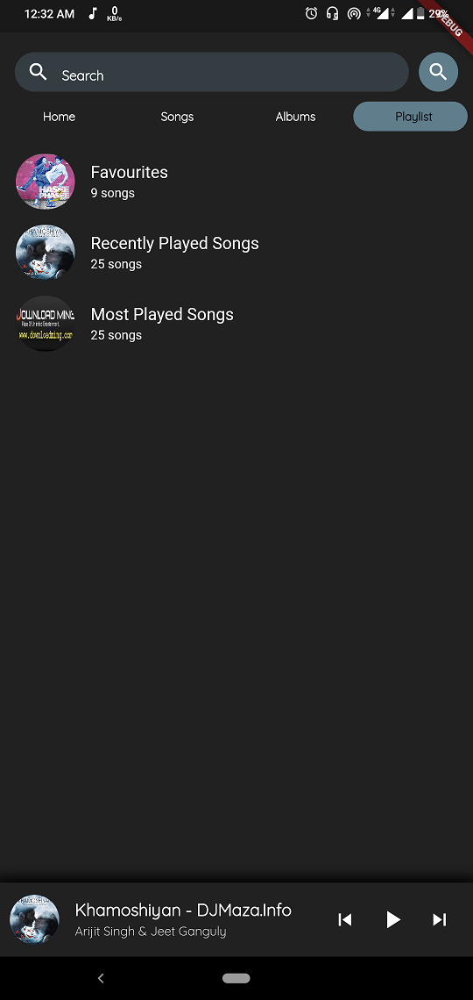
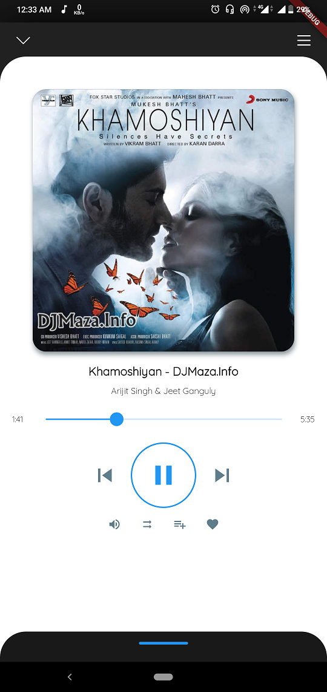
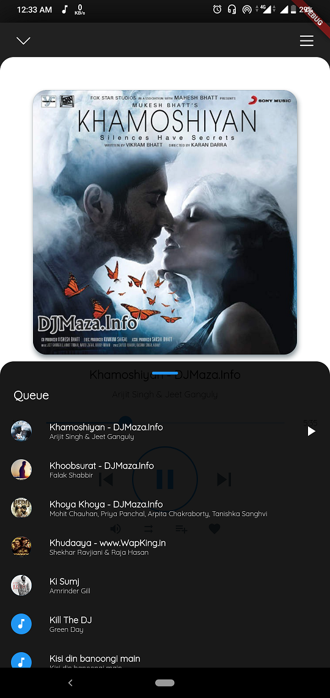
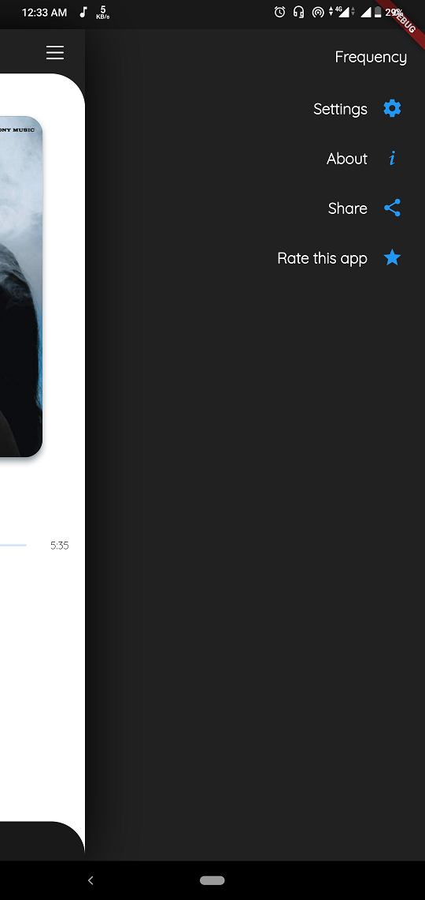
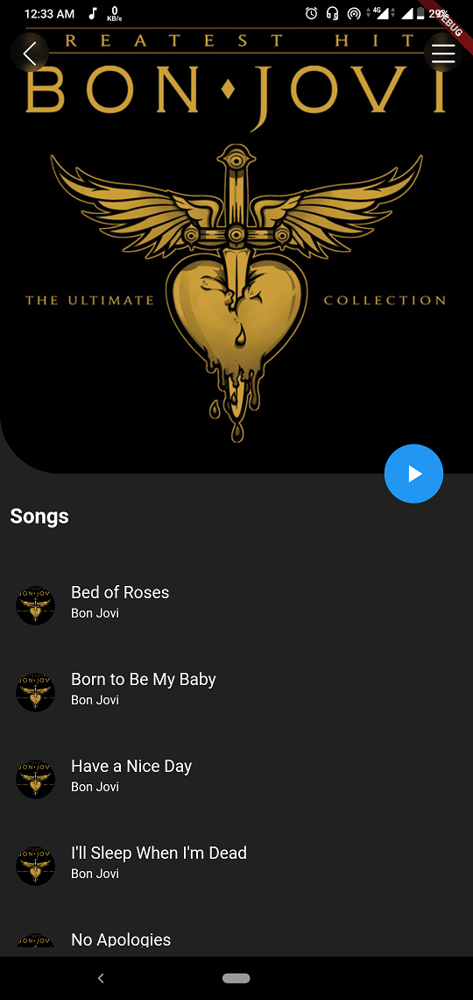

# Music Player - Flutter

A complete music player designed in flutter. This app uses SQLite database to store songs information that enables faster of songs at startup. Only one time setup for loading songs into database is needed.

This app has a lot of features and more will be added.

This app may have bugs which will be fixed in future.

# Features
* Play local songs
* SQLite database support
* Most Played songs, Recent songs, Random songs
* Album view, Playlist view
* Playing Queue, shuffle, Add to favourites, Add to playlist, create playlist
* Swipe gestures to change song

# Problems
* Search feature not working properly/inefficiently
* Shuffle

# Features to be added in future
* Themes(dark/light)

# Screenshots
       

# Plugins
Music player plugin => [Flute Music Player](https://github.com/iampawan/Flute-Music-Player) by [Pawan Kumar](https://github.com/iampawan)\
SQLite plugin => [SQLite (sqflite) plugin for Flutter](https://github.com/tekartik/sqflite) by [Tekartik](https://github.com/tekartik)

# License
MIT License

Copyright (c) 2020 Prateek Kumar Oraon

Permission is hereby granted, free of charge, to any person obtaining a copy
of this software and associated documentation files (the "Software"), to deal
in the Software without restriction, including without limitation the rights
to use, copy, modify, merge, publish, distribute, sublicense, and/or sell
copies of the Software, and to permit persons to whom the Software is
furnished to do so, subject to the following conditions:

The above copyright notice and this permission notice shall be included in all
copies or substantial portions of the Software.

THE SOFTWARE IS PROVIDED "AS IS", WITHOUT WARRANTY OF ANY KIND, EXPRESS OR
IMPLIED, INCLUDING BUT NOT LIMITED TO THE WARRANTIES OF MERCHANTABILITY,
FITNESS FOR A PARTICULAR PURPOSE AND NONINFRINGEMENT. IN NO EVENT SHALL THE
AUTHORS OR COPYRIGHT HOLDERS BE LIABLE FOR ANY CLAIM, DAMAGES OR OTHER
LIABILITY, WHETHER IN AN ACTION OF CONTRACT, TORT OR OTHERWISE, ARISING FROM,
OUT OF OR IN CONNECTION WITH THE SOFTWARE OR THE USE OR OTHER DEALINGS IN THE
SOFTWARE.

## Getting Started

For help getting started with Flutter, view our
[online documentation](https://flutter.dev/docs), which offers tutorials,
samples, guidance on mobile development, and a full API reference.
